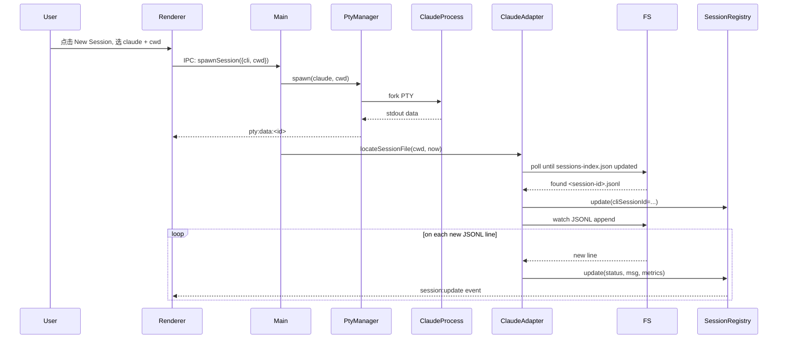

# Agent Dashboard — Design Document

**Status:** Draft v1
**Date:** 2026-05-27
**Author:** with Claude Code
**Platform:** macOS only

---

## 1. Goals & Non-Goals

### Goals (P0)
- **统一前端**托管多个 AI CLI（Phase 1：Claude Code + Codex；Gemini 留到 Phase 2）的交互式 session
- **网格看板**一眼看到所有 session 的状态：`working / waiting-for-input / idle / errored`
- **状态卡片**显示：最新一条消息预览、token/成本、cwd + git branch、当前工具调用
- **完整 terminal 交互**：可以输入、可以中断（Ctrl-C）、可以滚动历史，最终替代 Ghostty 跑这些 CLI
- **macOS 原生提醒**：waiting-for-input 时通过系统通知 + 菜单栏图标 + Dock badge + 声音提醒
- **Session 恢复**：dashboard 重启后，可一键 resume 上次的 session（用 CLI 原生的 `--resume`）

### Non-Goals (Phase 1)
- ❌ 跨机器聚合（只本机）
- ❌ 跨平台（只 Mac）
- ❌ 接管在外部 terminal（Ghostty/iTerm）里启动的 session
- ❌ 协作 / 多用户
- ❌ 替代通用 terminal（只跑 AI CLI，不当 zsh shell 用）
- ❌ AI CLI 间的消息相互传递（Phase 2+ 再考虑）

### Success Criteria
- 用户能在 dashboard 内同时跑 **1 个 Claude Code + 1 个 Codex** session（跨不同项目），稳定运行 ≥4 小时，期间正确响应输入、resize、中断（Ctrl-C）
- Resume：Cmd+Q 后再启动 dashboard，能从上次 session 列表中一键 resume，两个 CLI 都生效
- **Polling 模式**：waiting 状态在 10 秒内通过 UI 高亮 + Dock badge 反映
- **Hook 模式（用户开启）**：waiting 状态在 3 秒内 macOS 系统通知 + 声音
- 扩展目标：≥3 session 同跑（Codex 的 review 建议先保守，达成基础后再扩）

---

## 2. Architecture Overview

```
┌────────────────────────────────────────────────────────────────┐
│ Electron Renderer Process (Next.js + React + xterm.js)         │
│                                                                │
│ ┌──────────────┐  ┌──────────────────────────────────────────┐ │
│ │ Sessions     │  │ Active Session View                      │ │
│ │ Grid/List    │  │ ┌──────────────────────────────────────┐ │ │
│ │              │  │ │ xterm.js Terminal (PTY mirror)       │ │ │
│ │ • Claude/A 🟢│  │ │                                      │ │ │
│ │ • Claude/B 🟡│  │ │                                      │ │ │
│ │ • Codex/C  🔴│  │ └──────────────────────────────────────┘ │ │
│ │              │  │ ┌──────────────────────────────────────┐ │ │
│ │              │  │ │ Side Panel: status, tokens, cwd,     │ │ │
│ │ + New Session│  │ │   branch, current tool, last msg     │ │ │
│ └──────────────┘  │ └──────────────────────────────────────┘ │ │
│                   └──────────────────────────────────────────┘ │
└────────────────────────────┬───────────────────────────────────┘
                             │ Electron IPC (ipcRenderer ↔ ipcMain)
┌────────────────────────────▼───────────────────────────────────┐
│ Electron Main Process (Node.js)                                │
│                                                                │
│ ┌─────────────┐ ┌──────────────┐ ┌──────────────────────────┐ │
│ │ Session     │ │ PTY Manager  │ │ State Extractor          │ │
│ │ Registry    │ │ (node-pty)   │ │ ┌──────────┬───────────┐ │ │
│ │             │ │              │ │ │ Claude   │ Codex     │ │ │
│ │ persisted:  │ │ spawn/write/ │ │ │ adapter  │ adapter   │ │ │
│ │ session     │ │ resize/kill  │ │ └──────────┴───────────┘ │ │
│ │ history     │ │              │ │ (Gemini adapter: Phase 2)│ │
│ │             │ │              │ │  watch JSONL + parse     │ │
│ └─────────────┘ └──────────────┘ └──────────────────────────┘ │
│                                                                │
│ ┌──────────────────────────────────────────────────────────┐  │
│ │ macOS Integration: Tray (menubar), Dock badge, Notif,    │  │
│ │ powerSaveBlocker (防睡眠)                                │  │
│ └──────────────────────────────────────────────────────────┘  │
└────────────────────────────────────────────────────────────────┘
                             │
                             ▼
       ┌──────────────────────────────────────────────────┐
       │ Local files (the CLIs already write these)       │
       │                                                  │
       │ ~/.claude/projects/<cwd-hash>/<id>.jsonl         │
       │ ~/.claude/projects/<cwd-hash>/sessions-index.json│
       │ ~/.codex/sessions/*.jsonl                        │
       │ ~/.codex/session_index.jsonl                     │
       │ ~/.gemini/tmp/...    (TBD)                       │
       └──────────────────────────────────────────────────┘
```

### Process Model & Lifecycle

遵循 **macOS 标准 app 生命周期** —— 区分"关窗口"和"退出 app"：

| 用户操作 | 行为 |
|---|---|
| `Cmd+W` / 点窗口左上角叉 | **只关窗口**；app 继续在后台运行；所有 PTY 不动；menubar 图标和 Dock badge 继续工作并响应通知 |
| 点击 Dock 图标 / menubar 菜单某项 | 重新打开主窗口，恢复到上次视图 |
| `Cmd+Q` / 菜单 Quit Agent Dashboard | **完全退出**；杀掉所有 PTY；清空 menubar / Dock；不再发通知 |
| `Cmd+Q` 时有 working session | 弹 confirm 列出活跃 session，让用户选 "Cancel" / "Quit Anyway" |

Electron 实现要点：`app.on('window-all-closed', e => { if (process.platform === 'darwin') e.preventDefault() })` —— 这一行让 app 在最后一个窗口关闭时**不退出**，符合 macOS 习惯（Slack、Things、Cron 都是这个模式）。

**没有额外 daemon** —— 这里的"app 继续运行"是 Electron 主进程自己在跑（包含 menubar Tray、Dock、所有 PTY），不是独立的 background service。

### Single Instance
通过 `app.requestSingleInstanceLock()` 强制只能有一个 dashboard 在跑。第二次启动 → 把焦点交回已有窗口（带上启动时传的参数，例如 deep link）。两实例会争抢 hook endpoint / sessions.json，**必须**避免。

---

## 3. Component Design

### 3.1 PTY Manager (`src/main/pty-manager.ts`)

**职责：** 管理所有 node-pty 子进程的生命周期。

**接口：**
```ts
interface PtyManager {
  spawn(opts: SpawnOptions): SessionId          // 启动新 PTY，返回 internal session id
  write(id: SessionId, data: string): void      // 用户输入
  resize(id: SessionId, cols: number, rows: number): void
  kill(id: SessionId, signal?: 'SIGTERM' | 'SIGINT'): void
  list(): SessionId[]
  on(event: 'data' | 'exit', listener): void
}

interface SpawnOptions {
  cli: 'claude' | 'codex' | 'gemini'
  cwd: string
  args?: string[]               // 例如 ['--resume', '<session-id>']
  env?: Record<string, string>  // 默认继承 process.env，可覆盖
}
```

**实现要点：**
- **不**在 shell 里跑 CLI 命令字符串（quoting/injection 风险）。两步走：
  1. 启动时跑一次 `bash -lc "command -v claude"` 之类的探针，把绝对路径缓存
  2. spawn 时 `pty.spawn(absolutePath, argsArray, { cwd, env })` —— argv 模式，无 shell 介入
- 同时探测每个 CLI 是否登录（如 `claude --version` 退出码 + stderr 检查），未登录在 UI 上提示让用户先在外部跑一次登录
- 维护 `Map<SessionId, IPty>`
- `data` 事件直接转发给 renderer 通过 IPC channel `pty:data:<id>`
- `exit` 事件触发 session registry 更新

**Pitfalls 已知：**
- nvm-installed Node 二进制路径问题 → 通过登录 shell 探针解析路径，不要在 spawn 时挂 shell
- Apple Silicon 上 node-pty 需 universal binary 或正确架构编译
- 多个 renderer 窗口同时显示同一 session（未来需求）时 PTY resize 谁说了算 → 实际 resize 取所有 viewer 中**最小**的 cols/rows

### 3.2 Session Registry (`src/main/session-registry.ts`)

**职责：** session 元数据的真相源，订阅 PTY + state extractor 的事件并广播给 renderer。

**Session 数据模型（运行时）：**
```ts
interface Session {
  id: SessionId                         // dashboard 内部 ID（uuid）
  cli: 'claude' | 'codex' | 'gemini'   // Phase 1：claude/codex only
  cliSessionId: string | null           // CLI 自己生成的 session id（用于 resume）
  cwd: string
  gitBranch: string | null
  displayName: string                   // 自动生成，Phase 2 才提供 rename UI
  status: 'starting' | 'working' | 'waiting' | 'idle' | 'errored' | 'exited'
  statusConfidence: 'high' | 'low'      // hook 来源 = high；JSONL 推断 = low
  startedAt: Date
  lastActivityAt: Date

  metrics: {
    tokensInput: number
    tokensOutput: number
    estimatedCostUSD: number
    messageCount: number
  }

  latestMessage: {
    role: 'user' | 'assistant' | 'tool'
    preview: string                     // 截断到 200 字符
    timestamp: Date
  } | null

  currentTool: {
    name: string                        // 'Bash' / 'Edit' / 'Agent' 等
    description: string                 // 工具的 description 字段
    startedAt: Date
  } | null

  ptyExitCode: number | null
}
```

**Session 数据模型（持久化）：**
存到 `~/Library/Application Support/agent-dashboard/sessions.json`，仅记元数据，**不**复制 JSONL 内容：
```ts
interface PersistedSession {
  id, cli, cliSessionId, cwd, displayName, startedAt
  // 没有 status / metrics / latestMessage —— 这些下次启动时按需从 JSONL 重新解析
}
```

### 3.3 State Extractor (`src/main/extractors/`)

**职责：** 把每个 CLI 的 JSONL/事件源转译成统一的 `Session` 更新。

**抽象：**
```ts
interface CliAdapter {
  cli: 'claude' | 'codex' | 'gemini'

  // 启动命令：返回要 spawn 的参数
  buildSpawnArgs(opts: { resume?: string }): string[]

  // 给定一个 cwd 和 PTY 启动时间，找到这个 CLI 写在 disk 上的 session 文件
  // （CLI 启动后，需要等几百 ms 让它创建文件）
  locateSessionFile(cwd: string, after: Date): Promise<string | null>

  // 订阅文件追加，解析每个新 JSONL 行，emit SessionUpdate
  watch(file: string): AsyncIterable<SessionUpdate>

  // 列出该 CLI 在某个 cwd 下可恢复的 session
  listResumable(cwd: string): Promise<ResumableSession[]>
}

interface SessionUpdate {
  status?: Session['status']
  cliSessionId?: string
  metrics?: Partial<Session['metrics']>
  latestMessage?: Session['latestMessage']
  currentTool?: Session['currentTool'] | null
  gitBranch?: string
}
```

**Per-CLI 适配器（详见 §5）。**

### 3.4 Renderer UI

**框架：** Next.js (App Router, SSR 关闭，纯 SPA 模式) + Tailwind + xterm.js

**主要视图：**

| 视图 | 路径 | 说明 |
|---|---|---|
| Dashboard | `/` | 左侧 session 列表（卡片），中央 active session 终端 + 右侧 side panel |
| New Session | `/new` (modal) | 选 CLI / 选 cwd / 选 resume 已有 session / 起 fresh |
| Settings | `/settings` | 通知偏好、键盘快捷键、CLI 路径覆盖 |

**Session 卡片（列表里的一行/格子）：**
```
┌─────────────────────────────────┐
│ 🟢  Claude · agent-dashboard    │  ← cli + displayName
│     main · 3 msgs · $0.42        │  ← branch · msgCount · cost
│     "Writing the PTY manager..." │  ← latestMessage preview
└─────────────────────────────────┘
```

**状态颜色：**
- 🟢 working
- 🟡 waiting-for-input
- 🔴 errored
- ⚪ idle (空闲未输入)
- ⚫ exited

**Active session view（中央 + 右侧）：**
- **中央**：全功能 xterm.js，支持复制粘贴、resize、键盘组合键
- **右侧 side panel**：实时显示 cwd、branch、metrics、currentTool、最近 5 条消息历史

**键盘快捷：**
- `Cmd+1..9`：切换到第 N 个 session
- `Cmd+T`：新 session
- `Cmd+W`：关闭当前 session（带确认）
- `Cmd+K`：聚焦 session 搜索

---

## 4. Data Model — Persisted Files

`~/Library/Application Support/agent-dashboard/`
```
├── sessions.json          # PersistedSession[]
├── settings.json          # 用户偏好
└── logs/
    └── main.log           # Electron main process 日志
```

**`sessions.json` 是恢复源**：dashboard 启动时读它，把每条 PersistedSession 展示在"上次的 session"列表，用户选择 resume 时调用对应 CLI 的 resume 命令。

---

## 5. Per-CLI Adapters

### 5.1 Claude Code Adapter

**Spawn:**
```sh
claude                                # 新 session
claude --resume <session-id>          # resume
claude -c                             # continue most recent in cwd
```

**Session 文件：**
`~/.claude/projects/<cwd-encoded>/<session-id>.jsonl`，其中 `<cwd-encoded>` = cwd 把 `/` 替换为 `-`。

**Session 索引：** `~/.claude/projects/<cwd-encoded>/sessions-index.json` 已有结构化字段（`sessionId, firstPrompt, summary, messageCount, created, modified, gitBranch`）—— 直接读，不用自己重新算。

**状态推断：**
| JSONL 末尾事件 | 推断的 status |
|---|---|
| `type: "assistant"` 的最后一行有 `tool_use` 块 + 后续没有 `tool_result` | `working` (在执行工具) |
| 最后一行是 `assistant` 且无未匹配 tool_use | `waiting` (等用户输入) |
| 没有事件追加超过 30s 且最后是 `user` 类型 | `working` (在思考) |
| 文件 N 秒无变化 + 进程退出 | `exited` |

**辅助信号（更可靠）：** 用 Claude Code 的 hooks 把 `Stop` / `Notification` / `PostToolUse` 事件实时推给 dashboard，把 `statusConfidence` 从 `low`（仅 JSONL 推断）升到 `high`。

**安全模型（重要）：**
1. Dashboard 启动时绑定 `127.0.0.1` 上的随机端口，生成随机 bearer token，把 `{pid, port, token, startedAt}` 写入 `~/Library/Application Support/agent-dashboard/instance.json`（mode 0600）
2. 注入到 `~/.claude/settings.json` 的不是直接 curl，而是 dashboard 安装的脚本 `~/.claude/hooks/agent-dashboard.sh`，脚本逻辑：
   - 读 `instance.json`；不存在或文件 mtime 过老（>1h）→ no-op exit
   - 用 token 调 `http://127.0.0.1:$port/hook` 带 session id + event + cwd
   - 服务端：验 token + 验 session id 是否在 dashboard 注册的 session 列表里，否则丢弃 → 保护用户在 Ghostty 等外部 terminal 启的 Claude session 不受影响
3. 端口 + token 滚动：每次 dashboard 启动重新生成
4. 卸载：Settings 里"Uninstall hook"一键移除 `settings.json` 中的 hook 块 + 删除脚本

**Phase 1 决策 — 双轨制（详见 §11 决策讨论）：**
- 默认 **polling-only 模式**：纯靠 JSONL 推断，零侵入，`statusConfidence: 'low'`
- 用户可在 Settings 主动开启 **hook 模式**：弹授权 modal，提供"Auto inject" / "Manual inject" 两种方式，开启后 `statusConfidence: 'high'`，"waiting 3 秒内通知"的 P0 SLA 才可达成

**Token / cost：** JSONL 每条 `assistant` 行里有 `usage: {input_tokens, output_tokens, cache_*}`，累加即可，cost 用本地表算（`model + token_type → $/M`）。

### 5.2 Codex Adapter

**Spawn:**
```sh
codex                                 # 新 session
codex resume <session-id>             # resume by id
codex resume --last                   # resume most recent
```

**Session 文件：** `~/.codex/sessions/` 下 `rollout-<timestamp>-<id>.jsonl`。完成后转入 `archived_sessions/`。

**Session 索引：** `~/.codex/session_index.jsonl`（append-only，每行一条 `{id, thread_name, updated_at}`）。

**事件格式（基于真实 rollout 文件验证 2026-05-27）：** 每行 `{timestamp, type, payload}`，已知顶层 `type`：

| top-level type | 含义 |
|---|---|
| `session_meta` | 首行；含 `id, cwd, originator, cli_version, model_provider, base_instructions` |
| `turn_context` | 含 `turn_id, cwd, approval_policy, sandbox_policy` |
| `response_item` | 模型/用户消息体，含 `payload.type` (`message`, `function_call`, `function_call_output` 等) 和 `role` |
| `event_msg` | 状态事件，含 `payload.type`（见下表） |

`event_msg.payload.type` 已观察到：`task_started`, `task_complete`, `user_message`, `agent_message`, `thread_name_updated`, `token_count`。

**Token / cost：** Codex **有** token 统计 —— `event_msg.payload.type === "token_count"` 提供 input/output 数。Phase 1 累计显示 token 数；cost 计算（model × price）若 Codex 不直接报 model price 字段，本地用一张 model→price 表算估计值，UI 标记为"~$X"。

**Status 推断：** `task_started` → `working`；`task_complete` → `idle`；`response_item` with `function_call` 出现 → `working` (tool call)；外加 PTY 末尾若有交互式 prompt 则推为 `waiting`（需 Phase 0 spike 验证 Codex 的交互模式）。

### 5.3 Gemini CLI Adapter — **Phase 2，本文档不展开**

Phase 1 不实现 Gemini 适配器。Phase 2 启动时再调研 `~/.gemini/` 下的 session 存储格式，复用 `CliAdapter` 接口添加 `GeminiAdapter`。

### 5.4 Adapter 调研任务（Phase 1 实现前要做）

- [ ] 跑一个真实 Claude Code session，dump JSONL 前后 10 行，确认 `type` 枚举和 `usage` 字段
- [ ] 跑一个 Codex session，确认 `type` 枚举、是否有 token usage（若没有，cost 字段在 UI 上显示 "—"）
- [ ] 验证 `claude --resume` / `codex resume` 在 PTY 中行为正常（无交互式 picker 卡住）
- [ ] 验证 `claude --name "<display>"` 在 PTY 中正确设置 session display name
- [ ] 实测 Claude `Notification` hook 的 payload 字段，确认能拿到 session id

---

## 6. Session Resume Model

**问题：** 用户关闭 dashboard 后，所有 PTY 被 kill。下次打开希望"接着上次"。

**方案：**
1. **spawn 时立即**写入 provisional record `{id, cli, cwd, startedAt, command, cliSessionId: null}` —— 不等 cliSessionId 被发现，避免崩溃丢历史
2. **cliSessionId 被发现后**异步更新这条 record
3. **退出 / Cmd+Q 前**最终 flush 一次（带 status='exited' 标记）
4. **启动时**：读 sessions.json + 调用每个 CLI 的 native index（Claude 的 `sessions-index.json`、Codex 的 `session_index.jsonl`），做一次 reconcile：
   - 我们记录的 cliSessionId 在 CLI 索引里找得到 → 可 resume
   - cliSessionId 是 null（首发现前崩溃）→ 用 `(cli, cwd, startedAt)` fuzzy 匹配 CLI 索引中相近时间窗口的 session 给用户选
   - 完全找不到 → 标记 "Session no longer available"，UI 灰显
5. **用户点击 resume**：用对应 CLI 的 resume 命令 spawn 新 PTY
6. 30 天未访问的旧 record 自动清理

**关键设计：** 我们**不持有** session 历史，所有历史都在 CLI 的 JSONL 里。Dashboard 只是个调度器 + viewer。

---

## 7. Notification System

**触发条件：** session 从 `working` 切换到 `waiting-for-input` 时（detect by Claude's `Notification` hook 或 idle 推断）。

**Channels:**
| 渠道 | API | 触发 |
|---|---|---|
| macOS 系统通知 | Electron `new Notification(...)` | 每次进入 waiting，点击通知聚焦该 session |
| Dock badge | `app.setBadgeCount(n)` | n = 当前 waiting session 数量 |
| 菜单栏图标 | `Tray` API | 图标显示 waiting 数；菜单列出每个等待中的 session，点击聚焦 |
| 声音 | renderer 播放 `<audio>` | 仅当 dashboard 不在前台 |

**用户可配：** Settings 里可关掉任意 channel，可设置"勿扰时段"（如夜间不响）。

---

## 8. UI/UX

### Layout
默认 **三栏**：
```
┌─────────────┬──────────────────────────────────┬──────────────┐
│ Sessions    │ Active Terminal                  │ Side Panel   │
│ list (220px)│ (flex-1, xterm.js)               │ (260px)      │
│             │                                  │              │
│ + filters   │                                  │ status       │
│ + search    │                                  │ metrics      │
│ + group by  │                                  │ tool calls   │
│   project   │                                  │ recent msgs  │
└─────────────┴──────────────────────────────────┴──────────────┘
```

可折叠左右栏（`Cmd+\\` 切换）以最大化 terminal 区。

### Grouping
Session 列表按 **project (cwd)** 分组，同项目 session 折叠在一起。

### New Session Flow
点击 "+ New Session" 弹 modal：
1. 选 CLI（Phase 1: Claude / Codex；Gemini Phase 2 解锁）
2. 选 cwd（最近用过的路径 + "Browse..."）
3. 可选：选一个该 cwd 下的旧 session resume
4. （Claude）可选：传 `--name` / `--model` / `--effort`
5. 确认 → spawn → 跳转到该 session 视图

---

## 9. Key Risks / Open Questions

| # | 风险 | 影响 | Mitigation |
|---|---|---|---|
| R1 | xterm.js 渲染 Claude/Codex 的交互式 UI（permission prompt、ANSI 动画）有 bug | 体验崩 | **Phase 0 spike**：先做最小 prototype 跑通 Claude Code，再继续 |
| R2 | Claude hooks 全局注入会影响用户在 Ghostty 里的 session | 副作用 | hook 脚本检查 `$CLAUDE_PROJECT_DIR` 与 dashboard 注册的 session 匹配再 POST，不匹配则 no-op |
| R3 | Codex/Gemini 文件格式未充分调研 | 适配器写错 | 调研任务（§5.4）先做完再写实现 |
| R4 | node-pty 在 Apple Silicon + Electron 的 native module 编译 | 启动失败 | 用 `electron-rebuild`，文档化构建步骤 |
| R5 | session 数量很多（>20）时左侧列表性能 | 卡顿 | 用 react-window 虚拟列表 |
| R6 | 用户 cwd 不是 git 仓库 | branch 字段为空 | UI 上 branch 显示 "—"，不视为错误 |
| R7 | 用户 Cmd+Q 时有 working session | 数据丢失 | Quit 前弹 confirm 列出活跃 session；关窗口（Cmd+W）不触发此问题，session 继续后台跑 |
| R8 | macOS 通知权限被用户拒绝 | 提醒失效 | 首次启动检测权限，引导用户开启；如果拒了，菜单栏 + Dock badge 仍然工作 |
| R9 | 防睡眠：长跑任务时 Mac 睡眠会冻结进程 | session 卡死 | 当任一 session=working 时调 `powerSaveBlocker.start('prevent-app-suspension')` |
| R10 | 本地 hook endpoint 被其他本机进程伪造请求 | 状态被污染、通知乱响 | endpoint 启动时写 `~/Library/Application Support/agent-dashboard/instance.json` 含 `{pid, port, token}`；hook 脚本读该文件用 bearer token 调用；endpoint 拒绝缺/错 token；只 bind `127.0.0.1` |
| R11 | CLI 未登录 / 登录过期 / 启动期间走 OAuth device flow | spawn 后卡在登录界面 | 启动 PTY 后给 2s grace，若 stdout 出现登录提示模式（"Sign in" / device code 等）→ 把 session 标 `errored` 并在 UI 提示用户先去外部 terminal 跑一次登录 |
| R12 | JSONL 里 tool result 可能含密钥 / token | 在状态卡侧栏意外泄露 | latestMessage 预览过敏感字段（API key 正则 / 密码字段）默认 mask；点击展开才显示 |
| R13 | 用户启动多个 dashboard 实例 | 状态冲突 / hook 端口冲突 | `app.requestSingleInstanceLock()`，第二次启动聚焦已有窗口 |

### 已决策的设计要点（用户确认后定稿）

1. **Session 命名 — 用 CLI 原生能力，不打扰用户**
   - Claude Code：spawn 时传 `--name "<auto>"`，`<auto>` 默认 `<basename(cwd)> · <HH:MM>`（例 `agent-dashboard · 14:32`）。Claude 自己的 sessions-index.json 会记录它，dashboard UI 直接读
   - Codex：Codex 启动后会从首条消息自动生成 `thread_name` 写入 `session_index.jsonl`，dashboard 等它写完读取即可；spawn 时不传名字
   - Dashboard 内部 displayName 字段允许用户重命名（仅显示用，不改 CLI 端）

2. **Hook 注入 — 首次启动授权弹窗，提供两种方式**
   - Dashboard 首次启动检测 `~/.claude/settings.json` 是否已注入 hook
   - 未注入：弹 modal 解释作用 + 提供两个按钮：
     - **"Auto inject"** → dashboard 直接写入（备份原文件为 `settings.json.bak.<timestamp>`）
     - **"Manual"** → 展示要复制的 JSON 片段 + 文件路径，给"Done"按钮让用户确认完成
   - hook 脚本本身用 `$CLAUDE_PROJECT_DIR` + dashboard 维护的 session-cwd 映射判断"是不是 dashboard 启的"，不是则 no-op，保护用户在 Ghostty 里的 session 不受打扰
   - 提供 "Uninstall hook" 按钮，settings 里可一键回滚

3. **菜单栏 / Dock 持久化 — 按 macOS 标准生命周期处理**（详见 §2 Process Model）
   - 关窗口 ≠ 退出 app；menubar 和 Dock 只要 app 还在跑就一直工作
   - 真正 Cmd+Q 时才清空

---

## 10. Out of Scope（Phase 2+ 候选）

- 跨机器 session 聚合（远程 SSH 入本机 dashboard）
- 在 session 之间转发上下文（"把 Claude 的设计交给 Codex 实现"）
- 历史 session 全文搜索
- 用 Claude Agent SDK 让 dashboard 自己当 orchestrator 分发任务
- Web 远程访问（手机看 dashboard）
- 命令调色板 / AI 助理（"给所有 errored 的 session 重试"）

---

## 11. Tech Stack 总结

| 层 | 选型 | 理由 |
|---|---|---|
| Shell | Electron (最新稳定版) | macOS 原生能力 + Web UI 灵活 |
| 主进程 | Node.js (Electron 内置) | 与 node-pty 生态对齐 |
| PTY | node-pty | 成熟、跨 CLI |
| 渲染进程框架 | Next.js (SPA 模式) | 用户偏好 + 团队熟悉 |
| UI | React + Tailwind + shadcn/ui | 快 |
| Terminal | xterm.js + addon-fit + addon-web-links | 事实标准 |
| 状态管理 | Zustand | 轻量，够用 |
| IPC | Electron contextBridge + ipc | 默认安全模型 |
| 文件监听 | chokidar | 比原生 fs.watch 稳 |
| 持久化 | JSON files (electron-store) | 数据小、易调试 |
| 测试 | Vitest + Playwright (E2E) | 主进程单测 + UI E2E |
| 构建 | electron-builder | 标准 |

---

## Appendix A — Mermaid Sequence: 新 session 启动



---

## Appendix C — Codex Design Review 决策记录

2026-05-27 第一轮 Codex 独立 review 提出的关键意见与处理：

| Codex 意见 | 处理 |
|---|---|
| Codex JSONL 事件格式描述错误 | 已修正 §5.2（top-level + event_msg subtypes 列出） |
| Hook 注入太危险作为 P1 基础 | **部分采纳**：改为双轨制（polling 默认 + hook 可选），加 token+port discovery+session allowlist 安全模型 |
| 本地 HTTP 端口无认证 | 采纳：§5.1 hook 安全模型 + R10 |
| 多实例未定义 | 采纳：§2 Single Instance + R13 |
| Resume 非崩溃安全 | 采纳：§6 改为 provisional-first 写盘 + reconcile |
| Status 语义太乐观 | 采纳：加 `statusConfidence` 字段 |
| Shell-mode spawn 引入 quoting 风险 | 采纳：§3.1 改为路径探针 + argv 直接 spawn |
| Codex cost 应该 cut | **拒绝**：Codex 有 `event_msg.payload.type=token_count`，token 可统计；cost 估算保留 |
| 用户可改 displayName 应该 cut | **部分采纳**：保留字段，rename UI 推到 Phase 2 |
| Gemini 仍在 P1 图里 | 采纳：架构图和 New Session flow 已移除 |
| Phase 1 scope 太大 | 采纳：success criteria 改为 1 Claude + 1 Codex 起步 |
| CLI 登录态 / 版本检测缺失 | 采纳：§3.1 加探针 + R11 |
| Log 泄露密钥风险 | 采纳：R12 mask 敏感字段 |

---

## Appendix B — Status state machine

```
        ┌──────────┐
        │ starting │  (PTY just spawned, no JSONL yet)
        └────┬─────┘
             │ first JSONL line appears
             ▼
        ┌──────────┐  user types       ┌─────────┐
        │  idle    │ ────────────────▶ │ working │
        └──────────┘                   └────┬────┘
             ▲                              │
             │ assistant message done       │ tool_use detected
             │ + no pending tool            │
             └──────────────────────────────┤
                                            ▼
                                       ┌──────────┐
              ┌──── waiting on input ───┤ waiting  │
              │ (Claude Notification hook)└──────────┘
              ▼
        ┌──────────┐
        │  errored │  (uncaught error in JSONL, or PTY exit code != 0)
        └──────────┘

        Any state ──── PTY exit ────▶ ┌─────────┐
                                      │ exited  │
                                      └─────────┘
```
